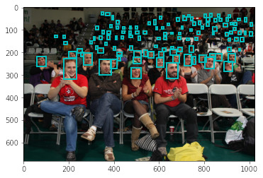

# open_images
Extract bounding boxes from Open Images dataset v4/v6.



## Getting Started

These instructions will get you a copy of the project up and running on your local machine for development and testing purposes.

### Prerequisites

Required:


Optional:


### Installing

#### Get the notebook.

```shell
# From your favorite development directory
git clone https://github.com/yinguobing/open_images.git
```

#### Download the dataset.
Please follow the official instructions:
https://storage.googleapis.com/openimages/web/download.html

It's better if the files are organized like this:

```bash
open_images
└── v6
    ├── annotation
    ├── test
    ├── train
    ├── validation
```

## Extraction

For dataset v6 just run the notebook.

```bash
jupyter-notebook
```

For dataset v4 please checkout branch `v4`, then run the notebook.


## Authors
Yin Guobing (尹国冰) - yinguobing


## License

